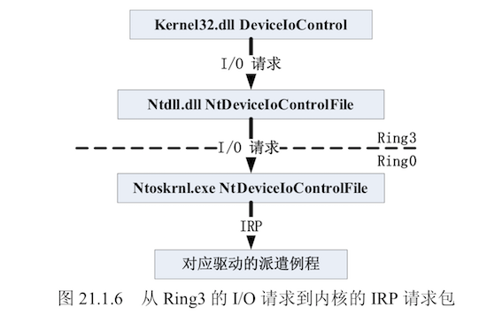

## 第四篇-操作系统内核安全

### 派遣例程与 IRP 结构

Ring3 程序调用 kernel32.dll 导出的 DeviceIoControl 函数后，会调用到 ntdll.dll 导出的
NtDeviceIoControlFile 函数，进而调用到系统内核模块提供的服务函数 NtDeviceIo ControlFile，
该函数会将 I/O 请求转化为 IRP 包，并发送到对应驱动的派遣例程函数中。

### 内核漏洞研究过程

- 漏洞重现环节

  如果该漏洞公布有 POC 源码，还需要对 POC 源码进行编译。

  如果最终重现失败，不能说明漏洞不存在。

  如果环境搭建的没有问题，那可以考虑是否 POC 源码有误，或者该漏洞还依赖于其他条件。

  因此，建议先进行漏洞分析环节，通过漏洞分析可以加深对漏洞的理解，这样边分析边重现。

- 漏洞分析环节

  如果有源码的话，可以先对源码进行白盒分析。

  如果没有源码可以对内核或驱动 PE 文件反汇编分析。

  如果漏洞公布中有 POC 源码的话，还可以对 POC 源码进行分析。

  如果该漏洞的补丁已经发布了，还可以在打补丁后，提取新版本的内核或驱动文件，通过对比进行分析;另外还可以通过给有漏洞的内核或驱动文件下断点进行调试分析。

  如果能触发有漏洞的内核或驱动蓝屏，还可以针对蓝屏后的 Memory D ump(完整转储、内核转储、小型内存转储)文件进行蓝屏分析。

- 漏洞利用环节

- 漏洞总结环节

  是在完成了漏洞重现、漏洞分析和漏洞利用过程后，回过头来审视造成该漏洞的根本原因，并提出修补方法的过程。如果把以上环节比喻为攻击，那么漏洞总结必须站在攻击与防御的对立面，才能有所体会和感悟，才能寻求到突破。通过漏洞总结，能够将学习过程中获取到的知识升华为一种经验和能力。

### 内核漏洞利用技术

更希望看到能够**篡改系统内核内存数据**或**执行Ring0 Shellcode**的漏洞，进而达到漏洞利用的目的。

  

