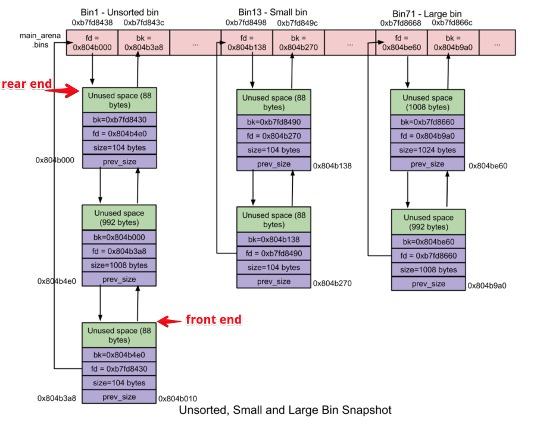

title: 堆内存小记 (不定时更新)

date: 2018-06-15 22:19:27

categories: 
- CTF
- 小记

健忘，所有才有这篇 “速查笔记”   _(:з」∠)_   **(水平有限难免会有错误)**

在glibc中用于记录bin的数据结构有两种，分别如下所示：

- **fastbinsY**: 这是一个数组，用于记录所有的fast bins；
- **bins**: 这也是一个数组，用于记录除fast bins之外的所有bins。事实上，一共有126个bins，分别是：

> bin 1 为unsorted bin
> bin 2 到63为small bin 
> bin 64到126为large bin

## Fastbins

- **size为[16](https://github.com/sploitfun/lsploits/blob/master/glibc/malloc/malloc.c?spm=a313e.7916648.0.0.aKGnqF#L1249)到[80](https://github.com/sploitfun/lsploits/blob/master/glibc/malloc/malloc.c?spm=a313e.7916648.0.0.aKGnqF#L1600)字节的chunk就叫做fast chunk**
- 个数：10个
- 使用 LIFO(后入先出) 算法：
  - 添加操作(free内存)就是将新的fast chunk加入链表尾
  - 删除操作(malloc内存)就是将链表尾部的fast chunk删除
- fastbins数组中每个fastbin元素均指向了该链表的rear end(尾结点),而尾结点通过其fd指针指向前一个结点。

## Bins

### Unsorted bin

- 个数： 1个。unsorted bin是一个由free chunks组成的循环双链表。
- 大小：在unsorted bin中，对chunk的大小并没有限制，任何大小的chunk都可以归属到unsorted bin中。

### Small bin

- **小于512字节的chunk称之为small chunk**
- 个数：62个
- **第一个small bin中chunk大小为16字节，后续每个small bin中chunk的大小依次增加8字节，即最后一个small bin的chunk为16 + 62 * 8 = 512字节**
- 每个small bin也是一个由对应free chunk组成的循环双链表。
- 采用FIFO(先入先出)算法：
  - 内存释放操作就将新释放的chunk添加到链表的front end(前端)
  - 分配操作就从链表的rear end(尾端)中获取chunk

### Large bin

- 大于512字节的chunk称之为large chunk
- 个数：63个
- 前32个large bin依次以64字节步长为间隔，
  - 第一个large bin中chunk size为512~575字节，
  - 第二个large bin中chunk size为576 ~ 639字节。
- 紧随其后的16个large bin依次以512字节步长为间隔；
- 之后的8个bin以步长4096为间隔；
- 再之后的4个bin以32768字节为间隔；
- 之后的2个bin以262144字节为间隔；
- 剩下的chunk就放在最后一个large bin中

## 内存申请顺序

最初所有的small bin都是空的，因此在对这些small bin完成初始化之前

用户请求的内存大小属于small chunk也不会交由small bin进行处理，而是交由unsorted bin处理，

如果unsorted bin也不能处理的话，glibc malloc就依次遍历后续的所有bins，找出第一个满足要求的bin，如果所有的bin都不满足的话，就转而使用top 

如果top chunk大小不够，那么就扩充top chunk

## 参考

http://www.freebuf.com/articles/security-management/105285.html

