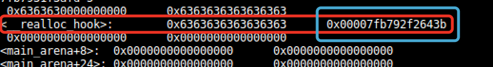

title: libc中的hook机制

date: 2018-04-09 21:08:36

categories:
- hook


__libc_malloc 中首先判断hook函数指针是否为空，不为空则调用它，并返回。

我们发现在malloc_hook_ini中把__malloc_hook赋值为NULl，这样就避免了递归调用。

同理在最后部分也有一个__malloc_initialize_hook的：默认为空。


libc中的hook机制，主要用于内存分配，它就像无处不在的钩子一样，一旦设置好了 hook，我们就可以在内存分配的地方随心所欲地做我们想做的事情。 
在malloc.h中，声明了一些hook，原型如下：

```c
/* Hooks for debugging and user-defined versions. */
extern void (*__free_hook) (void *__ptr, const void *);
extern void *(*__malloc_hook)(size_t __size, const void *);
extern void *(*__realloc_hook)(void *__ptr, size_t __size, const void *);
extern void *(*__memalign_hook)(size_t __alignment, size_t __size, const void *);
extern void (*__after_morecore_hook) (void);
```

从上面的注释中可以看出，我们可以自定义这些hook，用于debug。这些hook都是函数指针。

不仅malloc调用会进入我们自定义的malloc钩子，而且new、fopen（还有许多其它的函数）也会进入malloc钩子。需要注意的一点是，这些内存分配的钩子需要不断的还原和重置，也真是因为如此，hook机制不适用于多线程。

http://www.gnu.org/software/libc/manual/html_node/Hooks-for-Malloc.html

**malloc_hook 是一个 libc 上的函数指针，调用 malloc 时如果该指针不为空则执行它指向的函数，可以通过malloc_hook 来 getshell**

**要写入hook的后面八个字节(蓝框)**



## 参考

[linux内存管理之malloc](http://blog.chinaunix.net/uid-20786208-id-4979967.html)

[libc中的hook机制](https://blog.csdn.net/iEearth/article/details/49951567)

[malloc hook初探](https://www.jianshu.com/p/0d7aa3166eec)

